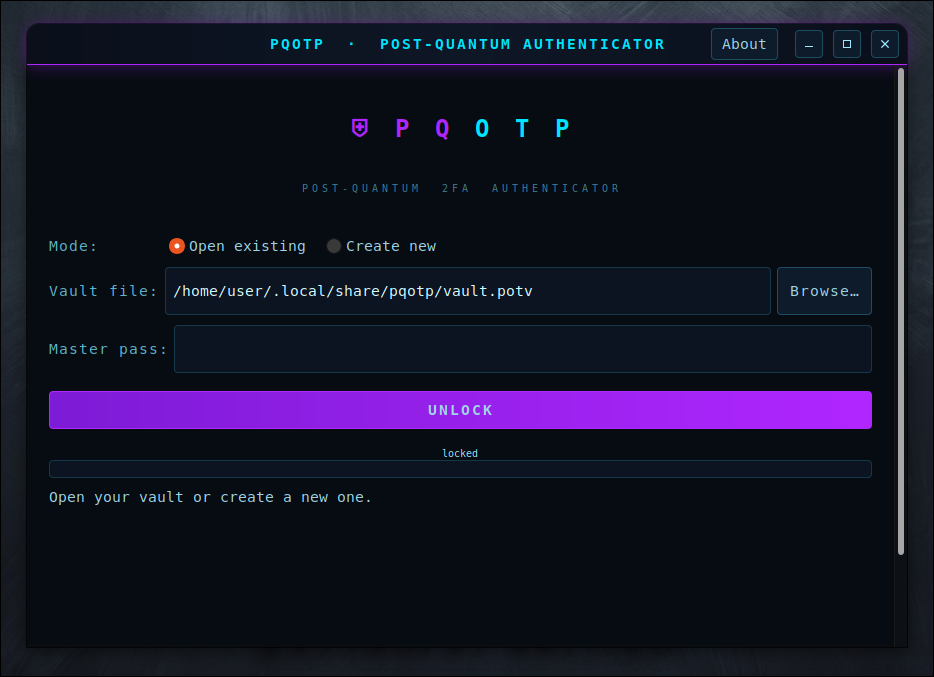

<div align="center">

<a href="https://github.com/effjy/pqotp/"></a>

**Post-quantum TOTP / HOTP authenticator — GTK3 app + CLI.**


<br>



</div>
<br>
PQOTP is a two-factor (2FA) authenticator that stores your TOTP/HOTP secrets in
a single encrypted vault — the companion to [PQPMan](https://github.com/effjy/pqpman).
Unlike Google Authenticator or Authy, the seed store is sealed with the same
**post-quantum hybrid** crypto core PQPMan uses, and nothing is ever synced to a
cloud you don't control.

- **Codes**: RFC 4226 (HOTP) and RFC 6238 (TOTP), SHA-1 / SHA-256 / SHA-512,
  6–10 digits, configurable period. Verified against the RFC 6238 test vectors.
- **At rest**: the serialized vault is one AEAD blob — **AES-256-GCM** or
  **XChaCha20-Poly1305** — whose key is derived with **Argon2id** and, in hybrid
  mode, wrapped in a **Kyber-1024 + X448** KEM layer. A single master password
  unlocks everything; a wrong password or any tampering fails the AEAD tag.
- **In memory**: master key and OTP secrets live in `mlock`'d, non-dumpable
  memory (core dumps disabled, `PR_SET_DUMPABLE` off); the master password is
  wiped right after key derivation.
- **On disk**: written via temp-file + `fsync` + `rename` (never corrupts an
  existing vault) with `0600` permissions.

The crypto envelope is byte-for-byte the PQPMan/Ciphers design; only the magic
(`PQOTP`) and the per-entry payload (issuer, account, raw HMAC secret, algorithm,
digits, period) differ.

PQOTP ships as both a **GTK3 desktop app** (`pqotp-gui`) and a **CLI** (`pqotp`)
that share the same vault format.

## Prerequisites

A C compiler, `make`, `pkg-config`, and the following libraries (with their
development headers):

| Library | Used for |
|:---|:---|
| `libsodium`  | AEAD ciphers, Argon2 raw API, X448, locked memory |
| `libargon2`  | Argon2id master-key derivation |
| `libcrypto` (OpenSSL) | HMAC-SHA1/256/512 and X448 |
| `gtk+-3.0`   | the desktop app only (not needed for the CLI) |

**Debian / Ubuntu**

```sh
sudo apt install build-essential pkg-config \
     libsodium-dev libargon2-dev libssl-dev libgtk-3-dev
```

**Fedora**

```sh
sudo dnf install gcc make pkgconf-pkg-config \
     libsodium-devel libargon2-devel openssl-devel gtk3-devel
```

**Arch**

```sh
sudo pacman -S base-devel libsodium argon2 openssl gtk3
```

The CRYSTALS-Kyber-1024 reference implementation is bundled in `src/kyber/`, so
there is no Kyber package to install.

## Compiling

```sh
make            # builds ./pqotp-gui (GTK3 app) and ./pqotp (CLI)
make clean      # removes build artifacts
```

To build against a different prefix or compiler, override the usual variables,
e.g. `make CC=clang` or `make PREFIX=/opt/pqotp`.

## Installation

```sh
sudo make install     # installs both binaries to $(PREFIX)/bin (default /usr/local),
                      # the icon (scalable SVG + 16–256 px PNGs) and the .desktop
                      # entry, so PQOTP shows up in the applications menu & taskbar
sudo make uninstall   # removes every file the install step created
```

After installing, `pqotp-gui` and `pqotp` are on your `PATH` and **PQOTP**
appears in the menu under *Utility / Security*.

## Usage

### Desktop app

Launch **PQOTP** from your applications menu, or run `pqotp-gui`. Create or open
a vault, then watch the live one-time codes refresh every second with a
per-code countdown — double-click a row (or **Copy code**) to copy the current
code; the clipboard auto-clears after 25 s. Add accounts by hand or paste an
`otpauth://` URI, then click **Save Vault** to write your changes to disk.

### CLI

```sh
# Create a post-quantum hybrid vault (default ~/.pqotp/vault.potv)
pqotp init                       # add --no-hybrid or --aes to change defaults

# Add an account from a QR-code's otpauth:// URI
pqotp add "otpauth://totp/GitHub:alice@example.com?secret=JBSWY3DPEHPK3PXP&issuer=GitHub"

# ...or by hand
pqotp add -i AWS -a root -s GEZDGNBVGY3TQOJQ --algo SHA256 --digits 8

pqotp list                       # accounts only, never the codes
pqotp code                       # current codes for every account
pqotp code github                # filter by issuer/account substring
pqotp remove 0                   # delete the account at index 0
```

Add `-f FILE` before any command to point at a specific vault, and run
`pqotp --help` for the full option list.

### Vault location

| Front-end | Default vault path |
|:---|:---|
| CLI (`pqotp`)        | `~/.pqotp/vault.potv` |
| Desktop (`pqotp-gui`)| `~/.local/share/pqotp/vault.potv` |

The two front-ends share one file format, so point either at the other's file
with `-f` (CLI) or the **Browse…** button (GUI) to use a single vault for both.

## Changelog

### v0.1.1

Bug-fix and hardening release — no vault-format changes; v0.1.0 vaults open
unchanged.

- **Hardened** the libsodium-backed secure entry buffer (master password and
  base32 secret fields): it now zeroes the unused tail of its guarded
  allocation on every edit, so a typed-then-cleared secret no longer lingers in
  locked memory, and guards its capacity growth against an integer overflow on
  a pathological paste.
- **Fixed** the GUI vault-creation flow: it now stays on the lock screen until
  the initial save succeeds and rolls back on failure, instead of stranding you
  in the vault view for a file that was never written.
- **Robustness:** vault loading now rejects trailing bytes after the declared
  accounts as corruption.

## License

MIT.
